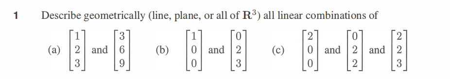
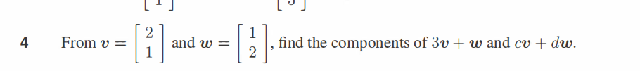
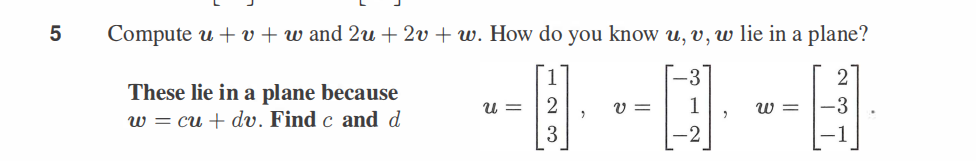
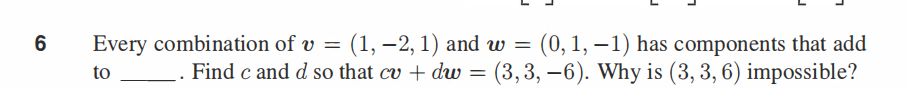

# Week 01 — Days 1 to 7

**Phase:** Phase 0 — Math & C Foundations
**Focus:** Linear Algebra — Vectors and Vector Operations

---

## Day 1 — Sunday, June 14 2026

**Phase :** Phase 0 — Math Foundations
\
**Topic :** **Introduction to vectors,linear combinations,span,vectors spaces**
\
**Time Spent :** 3 hours

---

## 📖 What I Studied
### i studied vectors, linear combinations of vectors,scalars that scale those vectors, spans of those vectors,  vector addtion and scalar multiplication
### watched the first 2 videos of 3 blue 1brown essence of linear alegbra playlist:
### 1- vectors 
### 2-linear combinations,span and basis vectors

### then i watch professor strangs lecture from playlist (MIT 18.06SC Linear Algebra, Fall 2011) :
### 1-The geomtery of lienar equations 
### then studied some part of the first chapter of professor strangs book , went through worked exmaples until problem set 1.1

---

## 💡 What I Understood
### vectors
i understood that a vector can represent anything in space a vector object..there are 3 views on vectors
#### 1-physics view : magnitude and direction
#### 2-mathematician view : the most unbaised one as it can chnage accordng to what is needed 
#### 3- cs view : list of numbers

but what i understood was it reprsents corrdinates of any object in vector space so its just a rperesntataion of list of numbers for an object in space 

and then i also learnt that we multiply vectors with numbers/scalars that scale those vectors extend or srhink them 
### basis vectors

 then i studied basis vectors are those vectors thta those sclaars scale in general  ij and k are unit vectors of one magnitude vhossing a didfferent  basis means our coordinate is different . in short coordinates are relative to the basis vetors you choose

 ### linear dependence vs linear independence
 in dependence theere are redundant vectors and there will be a case where the vector can be formed by combinations of other 2 vectors

 in indepdence each vector is necessary to define the soace and there is no duplcation the vector adds new spacea nd freedom so you can extend your reach

---

### 🔨 What I Built or Practiced:
didnt practice questions yet and no numpy verifications for today

---

### 📊 Result or Measurement:
not yet

---

### ❓ Still Confused
not confused in the things learnt at first i was in spaces in visulization of vectors and  depdnecne vs independence but that got cleared after asking ai many tims and eating its brain 😭.

---

### 📅 Tomorrow
#### i will do problem set 1.1 from professor strangs book and if time allows i will go for professor strangs question/problem solving lectures to solve questions
---

## Day 2 — Monday , June 15 2026

**Phase :** Phase 0 — Math Foundations
\
**Topic :** **Introduction to vectors,linear combinations,span,vectors spaces**
\
**Time Spent :** 1 hour

---

## 📖 What I Studied
### i solved some questions actually 6 problems from problem set 1.1. from professor strangs book 
 and i learnt somehting interesting about components and spans of vectors 
---

## 💡 What I Understood
### QUESTION 1:

i understood that a  single  vector lives on  al ine  2 vectors live on plane since a new dimesnion is added and three vectors live or span in all of 3d space

### Question 2:

this was a visulization task just perfomed opermed on the vector and drew the single diagram of the resultant vector

### Question 3

we treat thos evetcors as linear equations aadd both equations both sides to each other

### Question 4:

this is a simnple linear ombinations task of erfming operations on the vectors

### Question 5:

we know u ,v and w lie in a aplane and nto space since u and v combine to get to w and as w is redunadant and can be rached through combination of u and v and doesnt add anything new or new dimension the 2 vectpors exist in plane and as we have equation that equals the vectors to 0 we get the equation u+w+v=0 then we rearrange to egt w on other side and then solve accordingly

### Question 6:

this question taught me the most that any vector whose componeets suppose 3 componeets of a 2 vectors  (x,y,z)  add up to 0  means that those 2 vectors  lie on a  plane or formn a plane  in 3d space that passes trough the origin  and if the compoenents added to 0 have some other result they lie ona different plane  think of it as a different fllor that isnt reachable by the other floor

---

### 🔨 What I Built or Practiced:
didnt practice questions yet and no numpy verifications for today
as final exams have started 

---

### 📊 Result or Measurement:
not yet

---

### ❓ Still Confused
a little bit in visulzation of vectors with componenets but that will clear up after i solve   more questions

---

### 📅 Tomorrow
#### i will do problem set 1.1 onwards from question 6 and i will do them as many as time allows
---

## Day 3 — Tuesday, June 16 2026

**Phase:** Phase 0 — Math Foundations
**Topic:** 
**Time Spent:** 

---

### 📖 What I Studied

---

### 💡 What I Understood

---

### 🔨 What I Built or Practiced

---

### 📊 Result or Measurement

---

### ❓ Still Confused

---

### 📅 Tomorrow

---

## Day 4 — Wednesday, June 17 2026

**Phase:** Phase 0 — Math Foundations
**Topic:** 
**Time Spent:** 

---

### 📖 What I Studied

---

### 💡 What I Understood

---

### 🔨 What I Built or Practiced

---

### 📊 Result or Measurement

---

### ❓ Still Confused

---

### 📅 Tomorrow

---

## Day 5 — Thursday, June 18 2026

**Phase:** Phase 0 — Math Foundations
**Topic:** 
**Time Spent:** 

---

### 📖 What I Studied

---

### 💡 What I Understood

---

### 🔨 What I Built or Practiced

---

### 📊 Result or Measurement

---

### ❓ Still Confused

---

### 📅 Tomorrow

---

## Day 6 — Friday, June 19 2026

**Phase:** Phase 0 — Math Foundations
**Topic:** 
**Time Spent:** 

---

### 📖 What I Studied

---

### 💡 What I Understood

---

### 🔨 What I Built or Practiced

---

### 📊 Result or Measurement

---

### ❓ Still Confused

---

### 📅 Tomorrow

---

## Day 7 — Saturday, June 20 2026

**Phase:** Phase 0 — Math Foundations
**Topic:** 
**Time Spent:** 

---

### 📖 What I Studied

---

### 💡 What I Understood

---

### 🔨 What I Built or Practiced

---

### 📊 Result or Measurement

---

### ❓ Still Confused

---

### 📅 Tomorrow

---

## Week 1 Summary

> Fill this in on Day 7 — end of the week reflection.

**Total hours studied this week:**
**Topics covered:**
**Biggest thing I learned:**
**Biggest thing still confusing me:**

